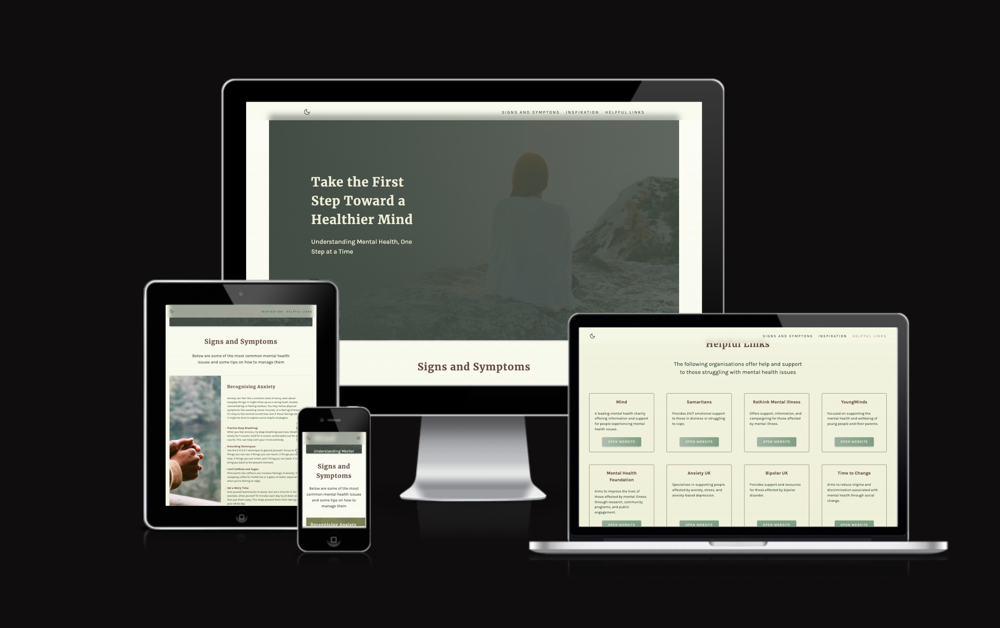

# Healthy Minds

Healthy Minds is a site that is dedicated to offering accessible, beginner-friendly information on mental health, including resources to help users recognise common mental health issues, manage stress, and find supportive strategies for everyday life.

Healthy Minds is designed to be a safe, welcoming space for users who may be new to exploring mental health topics. Our aim is to provide foundational knowledge on mental health topics in a supportive, organised layout.

## Key Features

- **Beginner-Friendly Information:** Content is tailored for those new to mental health awareness, focusing on the basics of mental well-being, recognizing signs of common issues, and stress management tips.
- **Supportive Design:** The site employs a clean, calming aesthetic and colour scheme to promote a stress-free browsing experience.
- **Organised Layout:** Using HTML, CSS, and Javascript, the site provides a structured, easy-to-navigate layout that enhances readability and accessibility for all users.

## Technology Stack

HTML,CSS and Javascript: Provides the backbone of the site’s structure and design.
Bootstrap: Adds responsive design elements, ensuring a user-friendly experience across various devices and screen sizes.

## User Stories

- As a first time user with mental health difficulties I want to visit a welcoming, calm website that is easy to navigate
- As a user, I want to find clear signs and symptoms of common mental health conditions so that I can better recognise them in myself or others.
- As a first time user with mental health difficulties I want to visit a welcoming, calm website that is easy to navigate
- As a user I want a list of links to external resources from trusted sources so that I can read more or seek help
- As a user I want to access a section with uplifting quotes so that I can get a quick dose of motivation and positivity

## Features

- **Navigation Bar**

  - The navigation bar is fully responsive and provides links to the sections on the website.
  - The navigation bar is sticky which will allow the user to easily navigate from one section io another.
  - The section links scroll to the relevant section - this behavious is turned off for users that prefer reduced motion

- **The landing page image**

  - The landing includes a calming photograph with text overlay welcoming the user to the site.

- This section displays cards describing some of the most common mental health issues.
- Each card can be expanded when clicked to shown a list of tips on how to manage them, preventing information overload for the user.
- At mobile the cards will display the list when clicked

- **Quotes section**

  - This section provides a carousel of random uplifting quotes that the user can use to cheer themselves up and feel supported

- **External links section**

  - This section provides the user with a number of websites they can visit for help and information. The cards provide a brief description of the organisation and a button that opens the website in a new tab.

## Credits

### Content

- The text for the Home page was produced by ChatGPT after a number of prompts
- The icons were taken from [Google Fonts](https://fonts.google.com/icons)

### Media

- The images used on the site are from [Unsplash](https://unsplash.com/)

### Other

- [Tiny PNG](https://tinypng.com/) to reduce image file sizes
- [Realtime colours](https://www.realtimecolors.com/) for experimenting with colour schemes
- [Fluid Type Scale](https://www.fluid-type-scale.com/)
- [CSS reset](https://piccalil.li/blog/a-more-modern-css-reset/)

## W3C Validator Testing

- HTML
  - W3C returned errors for trailing slashes added by the prettier formatting
- CSS

  - Some CSS errors found due to the use of custom properties

  ### Unfixed Bugs

  - It is only possible to click on cards to expand once.
  - Site performance is not great - while images have been compressed it may be necessary to use smaller sizes/the picture element. - minify javascript
    
